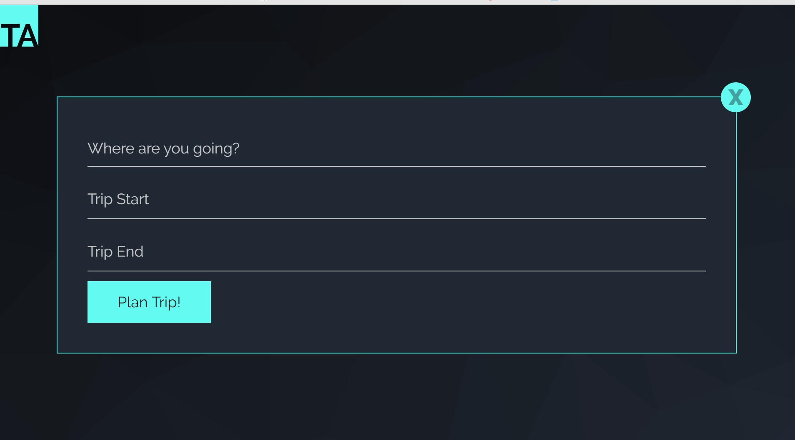
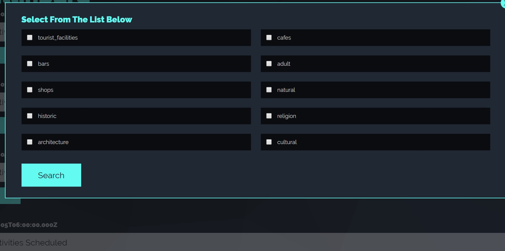

# Trip Assistant
https://ericenergy.github.io/tripAssistant_Project/
## Introduction
This application was developed with the purpose of creating a tool that will be helpful for any person that will be travelling to a place that they may not be familiar with.
It leverages existing third party APIs to provide the user with information that may be relevant for it’s upcoming trip.
Additionally, it utilizes the browser’s as a database to save their data; thus, avoiding the need for external data storage such as physical or cloud servers.

## How this Works

- The home screen will be where you will either create a new trip or bring up an exsisting trip to update. 

- After clicking to Create a new itinerary, a box will appear allowing you to enter the city you will be visiting so our 3rd party API know where it will need to search for actities, as well as a starting and ending date of you trip.

- After creating a new itinerary, you will click on a day you want to add an activity for. 

- Now you are ready to pick the type of activities you are looking to do while you are there. Go ahead and click on a few and hit search. 

- A list will now be populated of activities, or places to visit based on your selected criteria. Once you click on an option that has been populated for you, that activity will be added to you schedule.
---

## Technologies
- CSS Framework
- API’s (server-side and local)
- GitHub version control

---

## Planned Features

- Multi-user functionality
- Feature to remove dates from trip
- Feature to remove entire trips from database
- Display additional details for places
- Advanced search options:
  - Radius
  - Number of results

---

## Authors
- Eric Simmons
- John Humbracht
- Zac Talley
- Mario Cortes

---

## Collaborators and Acknowledgements
To:
- Anthony Cooper
- Jed Kendall
- Sasha Peters

